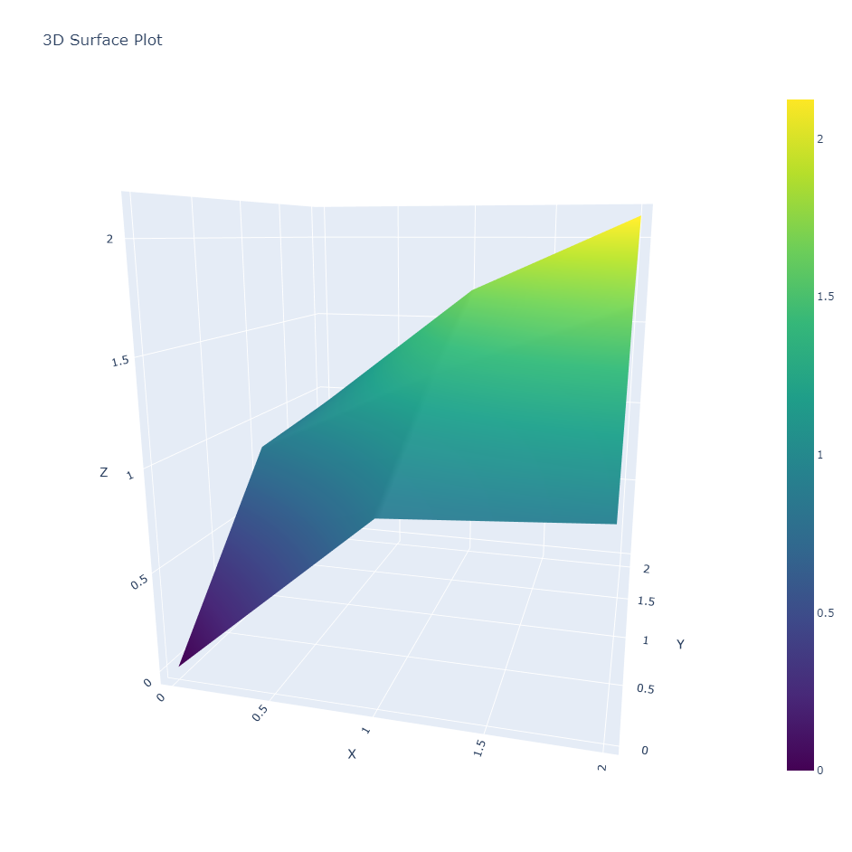

# Surface_Plot_3D


## Description

**Surface_Plot_3D** is a desktop application designed to create interactive 3D surface plots from CSV or TXT data files. This tool allows users to visualize complex 3D data with customizable axes titles and background themes. The application is built with PyQt5 for the user interface and Plotly for rendering the 3D plots. 

The application is designed with a sleek slate gray theme and supports saving plots as images directly from the Plotly interface in the browser.

## Features

- **3D Surface Plotting**: Create 3D surface plots from CSV or TXT files.
- **Customizable Axes Titles**: Set your own titles for X, Y, and Z axes.
- **Interactive Plots**: Use Plotly's interactive plotting capabilities.
- **Modern UI**: Designed with a Slate Gray theme for an enhanced user experience.
- **Cross-platform**: Available on Windows, macOS, and Linux.

## Installation

### Prerequisites

- Python 3.8 or higher
- `pip` (Python package installer)

### Steps

1. Clone the repository:

   ```sh
   git clone https://github.com/Hamed-Gharghi/Surface_Plot_3D.git
   ```

2. Navigate to the project directory:

   ```sh
   cd Surface_Plot_3D
   ```

3. Install the required Python packages:

   ```sh
   pip install -r requirements.txt
   ```

   **Note**: If the `requirements.txt` file is not available, manually install the dependencies:

   ```sh
   pip install pyqt5 plotly
   ```

## Usage

### Running the Application

To run the application, use the following command:

```sh
python Surface_Plot_3D.py
```

### Using the Application

1. **Select Data File**: Click on "Browse" to select a CSV or TXT file containing your 3D data.
2. **Set Axis Titles**: Enter titles for the X, Y, and Z axes in the corresponding fields.
3. **Show Plot**: Click on "Show Plot" to generate and view your 3D surface plot in a browser window.
4. **Saving the Plot**: In the Plotly interface in your browser, click on the camera icon in the top-right corner of the plot to save the image as a PNG file.

### Example Data File Format

Ensure your data file is formatted as shown below:

```
X,Y,Z
0.1,0.2,0.3
0.4,0.5,0.6
0.7,0.8,0.9
...
```

This is an example of a CSV/TXT file containing X, Y, and Z coordinates for each point on the surface plot.

## Example Plot

Here's a screenshot of a 3D surface plot generated by the application:



## Customization

### Theme

The application uses a custom Slate Gray theme:

- **Background Color**: `#2F4F4F` (slate gray)
- **Text Color**: `#F5F5F5` (very light gray)
- **Button Background**: `#708090` (slate gray)
- **Button Hover**: `#4682B4` (steel blue)

## License

This project is licensed under the MIT License - see the [LICENSE](LICENSE) file for details.

## Author

**Hamed Gharghi**

- [GitHub](https://github.com/Hamed-Gharghi)
- [Email](mailto:Hamedgharghi1@gmail.com)

## Acknowledgments

- [Plotly](https://plotly.com/python/) for providing powerful plotting capabilities.
- [PyQt5](https://www.riverbankcomputing.com/static/Docs/PyQt5/) for the UI framework.

## Tags

- `3D Plot`
- `Surface Plot`
- `Python`
- `PyQt5`
- `Plotly`
- `Data Visualization`
- `CSV`
- `TXT`
- `GUI`
- `Interactive Plot`


